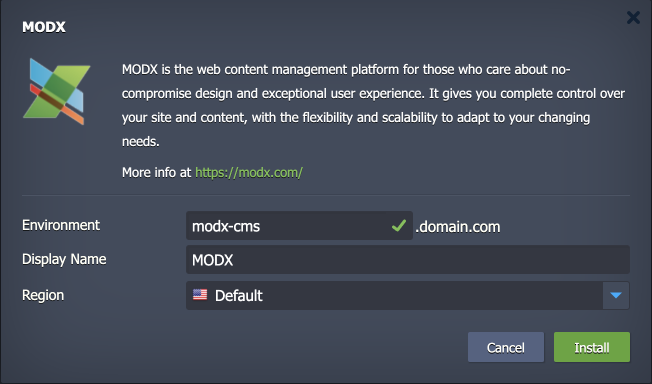

 

# MODX

The package deploys the [MODX](https://modx.com/) CMS solution - an open-source, powerful, and flexible content management system (CMS) that helps users to build and maintain websites. It offers a high degree of customization and scalability, making it suitable for a wide range of web projects, from simple blogs to complex web applications.

## Environment Topology

This package creates a dedicated MODX environment that contains one application server and one database container. It automatically deploys and sets the MODX application. The automatic vertical scaling is enabled out of the box, and [horizontal scaling](https://www.virtuozzo.com/application-platform-docs/automatic-horizontal-scaling/) can be configured (if needed). The default software stacks utilized in the package are the following:

- Apache 2 PHP application server (PHP 8.2)
- MySQL 8 database
- MODX 3.0.3

## Deployment to Cloud

To get your MODX solution, click the "**Deploy to Cloud**" button below, specify your email address within the widget, choose one of the [Virtuozzo Public Cloud Providers](https://www.virtuozzo.com/application-platform-partners/), and confirm by clicking **Install**.

> If you already have a Virtuozzo Application Platform (VAP) account, you can deploy this solution from the [Marketplace](https://www.virtuozzo.com/application-platform-docs/marketplace/) or [import](https://www.virtuozzo.com/application-platform-docs/environment-import/) a manifest file from this repository.

## Installation Process

In the opened installation window at the VAP dashboard, provide a preferred environment and display names, choose a region (if available), and confirm the installation.

Your MODX application will be automatically installed in a few minutes.
